# AI-900: Explorando os Recursos de IA Generativa com Copilot e OpenAI

-green)

-blue)


<br>

## Índice

- [Acessos necessários](#Acessos-necessários)
- [Descrição do Projeto](#Descrição-do-Projeto)
- [Acessos necessários](#Acessos-necessários)
- [Introdução](#Introdução)
- [Conhecendo a interface inicial do Microsoft Copilot](#Conhecendo-a-interface-inicial-do-Microsoft-Copilot)
- [Utilizando prompts para geração de respostas](#Utilizando-prompts-para-geração-de-respostas)
- [Utilizando prompts para geração de imagens](#Utilizando-prompts-para-geração-de-imagens)
- [Utilizando prompts para geração de códigos](#Utilizando-prompts-para-geração-de-códigos)
- [Conclusão](#Conclusão)
- [Certificados / Certificações Associados ao Projeto](#Certificados-/-Certificações-Associados-ao-Projeto)

<br>

## Descrição do Projeto

Este projeto é um dos laboratórios do Bootcamp [Microsoft Azure AI Fundamentals](https://web.dio.me/track/microsoft-azure-ai-fundamentals), promovido através da parceria entre a Microsoft e a Dio.me.

Os alunos deste bootcamp tem, como principal objetivo, se prepararem para o exame de certificação Microsoft AI-900, dominando conceitos como visão computacional, classificação inteligente de imagem e inteligência de documentos com IA, enquanto se familiarizam com as tecnologias da Microsoft Azure.

Este desafio é o de número 5 do bootcamp e consiste na execução prática de 3 exercícios, relacionados aos seguintes temas:

- [LAB 1: AI Com Microsoft Copilot](http://aka.ms/ai900-bing-copilot): explorar IA Generativa através do Microsoft Copilot
- [LAB 2: Azure OpenAI](http://aka.ms/ai900-azure-openai): explorar o serviço OpenAI do Azure e o utilizar para implantar e experimentar modelos de IA generativa
- [LAB 3: Filtros de Conteúdo Com Azure OpenAI](http://aka.ms/ai900-content-filters): explorar o efeito dos filtros de conteúdo padrão no Azure OpenAI

<br>

> [!NOTE]
> Este projeto foi desenvolvido utilizando-se uma subscrição pessoal do Azure.
> 
> Até a data de conclusão deste projeto, a Microsoft limitava o uso do Azure Open IA para empresas.
> 
> Solicitei o acesso através do [Formulário 'Request Access to Azure OpenAI Service'](https://aka.ms/oaiapply), porém o mesmo foi recusado justamente pelo fato da minha Microsoft Azure Subscription estar associada a uma conta pessoal, e não corporativa.
> 
> Por esse motivo, infelizmente, não foi possível realizar os LABs 2 e 3.

<br>

## Acessos necessários

Para realizar estes laboratórios, são necessários os seguintes acessos:

- [Conta Microsoft](https://account.microsoft.com/account/Account)
- [Subscrição do Microsoft Azure](https://azure.microsoft.com/)

<br>

## Introdução

O Microsoft Copilot é um assistente de inteligência artificial que pode auxiliar em diversas tarefas e funções nos aplicativos da Microsoft.

Ele utiliza a tecnologia GPT-4 e a busca do Bing para fornecer respostas relevantes e úteis.

O Microsoft Copilot foi lançado em março de 2023 e tem suporte ao pacote do Microsoft 365, ao Edge e ao Windows 11.

Ele pode criar documentos, planilhas, apresentações, e-mails, bate-papos e muito mais a partir de comandos de texto ou voz. Além disso, pode analisar dados, gerar imagens, editar vídeos, sugerir músicas e ativar recursos no sistema operacional.

Neste estudo, foram abordas as funções de geração de texto, imagens e códigos a partir de linguagem natural.

<br>

## Conhecendo a interface inicial do Microsoft Copilot

1) O Copilot pode ser acessado através do link [copilot.microsoft.com](https://copilot.microsoft.com/?azure-portal=true), utilizando sua conta Microsoft pessoal

2) O Microsoft Copilot usa IA generativa para aprimorar os resultados de pesquisa do Bing. Isso significa que, ao contrário da pesquisa isolada, que retorna conteúdo existente, o Microsoft Copilot pode reunir novas respostas com base na modelagem de linguagem natural e nas informações da Web
   
3) Na parte inferior da tela, há uma janela do tipo ***Pergunte-me qualquer coisa***. À medida que você insere prompts nesta janela, o Copilot usa todo o histórico de conversas para retornar as respostas.
    >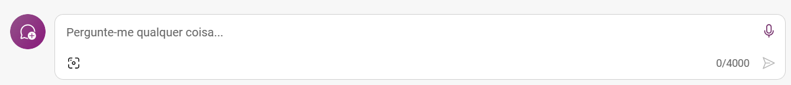

4) O Copilot permite trabalhar com 3 tipos de ***estilos de conversas***. Cada estilo retorna um esquema de cor, uma saudação e dicas iniciais de prompt diferentes. Os estilos são:
    * **Mais Criativo** (recomendado para respostas imaginativas e inovadoras, embora possam falhar em precisão):
        >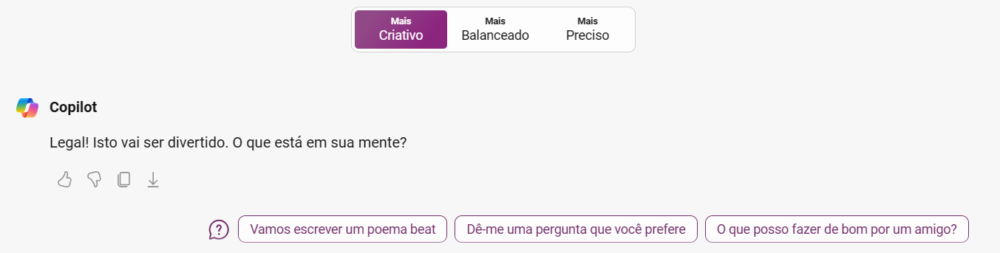

    * **Mais Balanceado** (recomendado para saídas altamente detalhadas e precisas, mas potencialmente menos criativas):
        >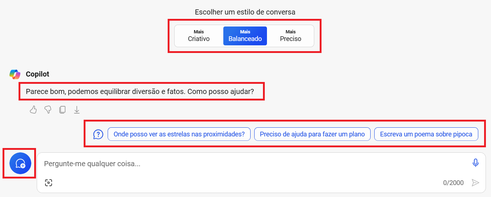

    * **Mais Preciso** (recomendado para um equilíbrio entre criatividade e precisão):
        >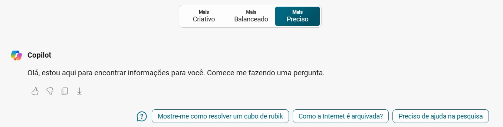

Nas próximas seções, serão exploradas 3 funções bastante úteis do Copilot: *geração de textos*, *geração de imagens* e *geração de códigos para programação*.

<br>

## Utilizando prompts para geração de respostas

Este á função mais amplamente utilizada no Copilot e, também, em outras ferramentas de IA Generativa.

Trata-se da utilização de prompts para realização de pesquisas por meio de conversas, por meio de linguagem natural, se tornando uma alternativa bem mais avançada e amigável em relação à utilização isolada dos motores de buscas convencionais, como Bing e Google, por exemplo.
> [!NOTE]
> Dois termos serão muito utilizados nesta seção (e nas seguintes), dentro do contexto de IA Generativa, e merecem uma rápida explicação. São eles:
>
> ***Prompt*** (frequentemente relacionado à **Engenharia de *Prompts***): É um texto em linguagem natural que solicita que a IA generativa execute uma tarefa específica
>
> ***Threads***: (linhas de execução): São sequências de instruções que fazem parte de um processo principal

Para realizar a geração de textos, proceda da seguinte forma:
- Digite um *prompt* e pressione **<kbd>Enter</kbd>**. Neste exemplo, o *prompt* utilizado foi:
   ```
   Me diga 3 prós e 3 contras de viajar de motorhome pelo Brasil
   ```

- Para esta pesquisa, foi utilizado o estilo de conversação **Preciso**, buscando um equilíbrio entre criatividade e precisão. Esta foi a resposta gerada:
   > 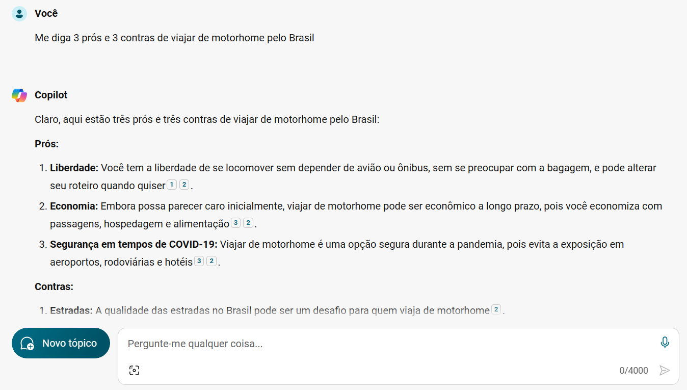

- A reposta retorna marcadores que possuem links paras as fontes de dados que foram utilizadas na pesquisa:
   >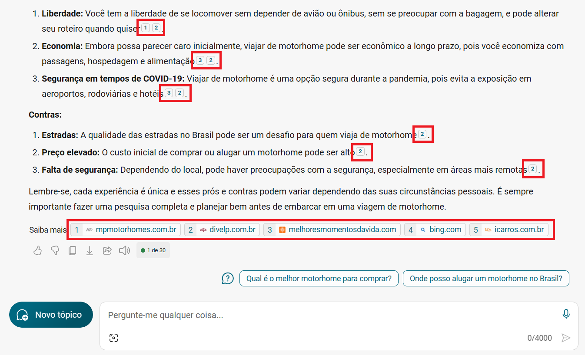

- Além disso, o Copilot sugere novos *prompts*:
   >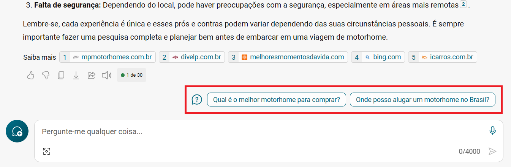

- Ao clicar em uma destas sugestões, ele continua a conversa, aproveitando as *threads* anteriores, e somente para a geração de informação quando finaliza a pesquisa e/ou o usuário interrompe a execução, por meio da opção **Parar de Responder**:
   >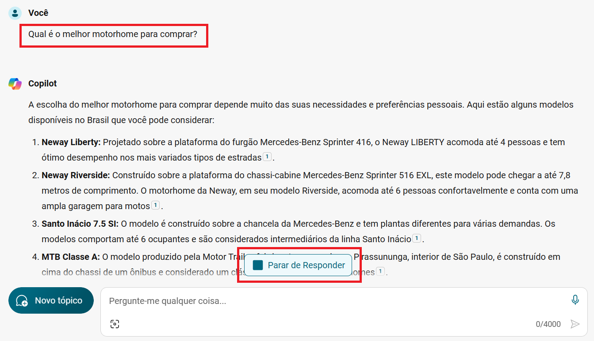

- Digitando um novo *prompt* e pressionando **<kbd>Enter</kbd>**, a conversa também continua, utilizando-se do histórico de *threads* para a contextualização, como no exemplo abaixo:
   ```
   Qual destes é o mais barato?
   ``` 
  >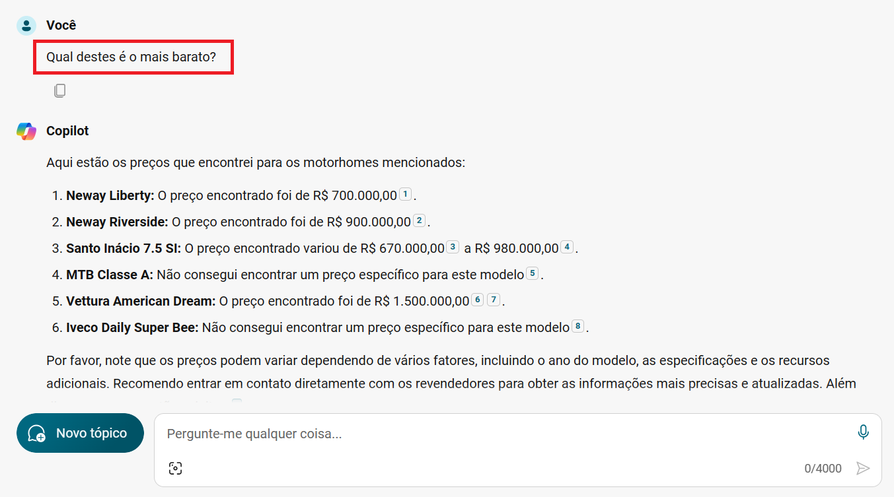

- Para iniciar uma nova conversa, sem qualquer tipo de relação com a conversa anterior, basta clicar em **Novo tópico**:
   >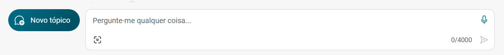

- Existe uma outra interface, dentro da ferramenta, na qual é possível avaliar o texto gerado, copiá-lo e/ou fazer o dowload. O nome dela é **NOTEBOOK**:
   >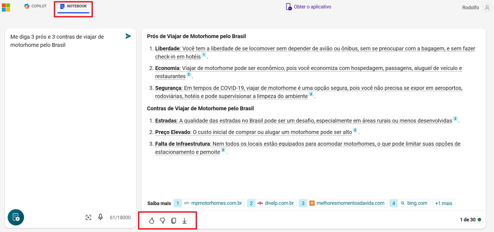

- Por fim, vale citar que, tanto na interface do **NOTEBOOK** quanto na interce **COPILOT**, ao invés de digitar um prompt, você pode ditá-lo, utilizando o ícone de microfone:
   >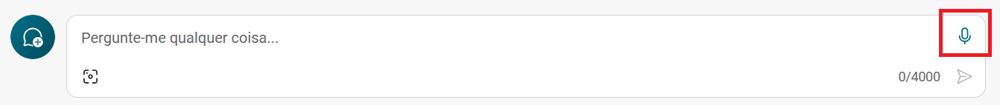

<br>

## Utilizando prompts para geração de imagens

Outra função bastante interessante no uso do Copilot é a geração de imagens a partir de prompts.

Este recurso pode ser utilizado tanto para fins recreativos como para demandas do dia-a-dia, inclusive profissionais.

Eis como gerar as imagens:
- Tal qual ocorre na geração de textos, digite um *prompt* e pressione **<kbd>Enter</kbd>**. Neste exemplo, o *prompt* utilizado foi:
   ```
   Crie uma imagem para ser utilizada no jogo Forza Horizon 5, sendo os carros uma VW Kombi apostando
   corrida com um VW Beatle. Como pano de fundo, coloque uma estrada à beira-mar.
   ```

- Como se trata de um prompt com fins recretivos, foi utilizado o estilo de conversação **Criativo**, permitindo que a pesquisa pudesse "viajar" um pouco, sem se preocupar com veracidade e precisão. Estas foram as imagens geradas:
   >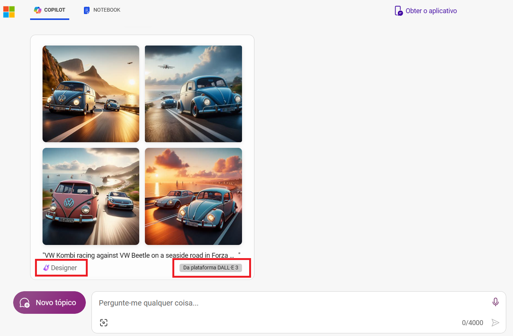


- Note que, no rodapé da imagem, aparece a *tag* "*Powered by* DALL-E". Isto ocorre devido ao fato do Copilot utilizar o DALL-E para a geração de imagens.
   > O ***DALL-E*** é uma rede neural treinada pela OpenAI, com base em modelos de linguagem grandes (LLM), que cria imagens a partir de legendas de texto para uma ampla gama de conceitos expressáveis em linguagem natural.

- Outra informação que é trazida no rodapé é a palavra **Designer**. Ela indica qual GPT o Copilot utilizou para gerar a imagem
   > ***GPT*** (*Generative Pre-Trained Transformer* ou Transformador Pré-treinado Generativo): São modelos de predição de linguagem baseados em redes neurais construídos na arquitetura *Transformer*. Eles analisam consultas em linguagem natural, conhecidas como solicitações, e preveem a melhor resposta possível com base em sua compreensão da linguagem.

- Na data de hoje (09/Mar/2024), que é quando este projeto foi escrito, o Copilot conta com 5 GPTs diferentes, com propostas diferentes, conforme print a seguir:
   > 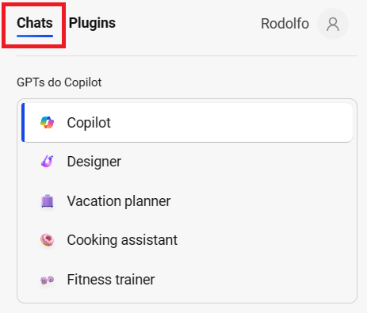

- Além disso, é possível utilizar *plugins*, desenvolvidos por terceiros, para melhorar/especializar o contexto dos *prompts*, limitados a 3 por conversa. O usuário deve ter consciência de que o teor das conversas serão sempre compartilhadas com os *plugins* utilizados. Segue um print de exemplo de alguns destes *plugins* disponíveis:
   > 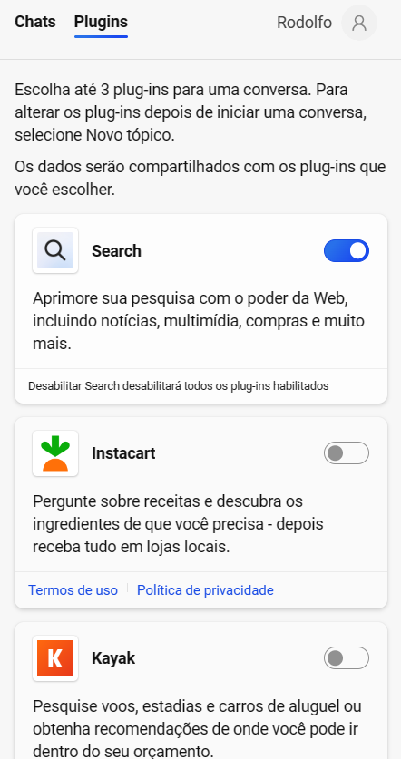

<br>

## Utilizando prompts para geração de códigos

Por fim, e não mais importante nem menos empolgante, o Copilot traz uma função que auxilia os desenvolvedores na criação de códigos de programação.

Esta opção pode ser muito útil durante a codificação, pois suporta o desenvolvedor na construção e ajustes de códigos das mais variadas linguagens de programação

- Segue um exemplo de utilização desta função:

   ```
   Escreva um código em Python, contendo uma classe genérica, com atibutos e métodos genéricos, além
   de um objeto instanciando-a. Este código será utilizado pelo usuário como modelo para criar suas
   próprias classes.
   ```

- Além de retornar a sintaxe, o Copilot traz uma breve descrição de como aplicar o código gerado:
   > 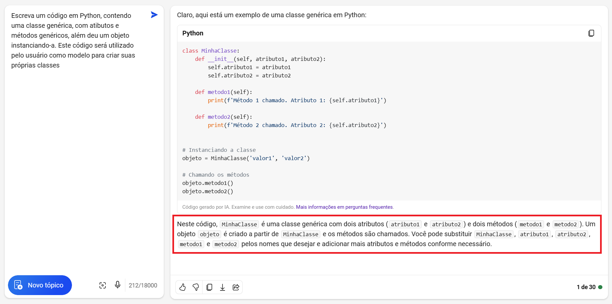


- Segue o código retornado, caso queira utilizá-lo em algum momento:

   ~~~Python
   class MinhaClasse:
       def __init__(self, atributo1, atributo2):
           self.atributo1 = atributo1
           self.atributo2 = atributo2
   
       def metodo1(self):
           print(f'Método 1 chamado. Atributo 1: {self.atributo1}')
   
       def metodo2(self):
           print(f'Método 2 chamado. Atributo 2: {self.atributo2}')


   # Instanciando a classe
   objeto = MinhaClasse('valor1', 'valor2')
   
   # Chamando os métodos
   objeto.metodo1()
   objeto.metodo2()
   ~~~

<br>

## Conclusão

O Microsoft Copilot é uma ferramenta revolucionária, que transforma a maneira como interagimos com a tecnologia.

Suas capacidades de geração de texto, imagens e códigos a partir de linguagem natural abrem novos horizontes para a programação e a comunicação. Através de sua inteligência artificial avançada, o Copilot não apenas facilita a vida dos programadores, mas também torna a tecnologia mais acessível para todos.

No entanto, como qualquer tecnologia emergente, é importante lembrar que o Copilot é uma ferramenta para auxiliar, e não substituir o julgamento humano.

À medida que continuarmos a explorar suas possibilidades, devemos também considerar as implicações éticas e de privacidade.

O futuro é promissor e o Microsoft Copilot é um passo significativo nessa jornada.

<br>

## Certificados / Certificações Associados ao Projeto


