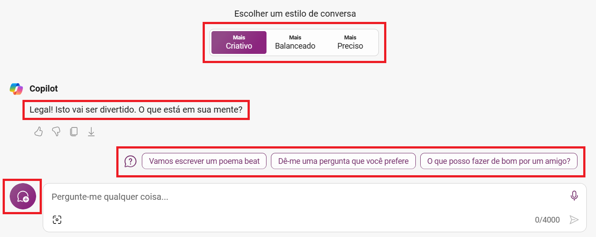

```
Me diga 3 prós e 3 contras de viajar de motorhome pelo Brasil
```

```
Qual destes é o mais barato?
```


```
Crie uma imagem para ser utilizada no jogo Forza Horizon 5, sendo os carros uma VW Kombi apostando corrida com um VW Beatle.
Como pano de fundo, coloque uma estrada à beira-mar
```


```
Escreva um código em Python, contendo uma classe genérica, com atibutos e métodos genéricos, além de um objeto instanciando-a.
Este código será utilizado pelo usuário como modelo para criar suas próprias classes
```


~~~Python
class MinhaClasse:
    def __init__(self, atributo1, atributo2):
        self.atributo1 = atributo1
        self.atributo2 = atributo2

    def metodo1(self):
        print(f'Método 1 chamado. Atributo 1: {self.atributo1}')

    def metodo2(self):
        print(f'Método 2 chamado. Atributo 2: {self.atributo2}')


# Instanciando a classe
objeto = MinhaClasse('valor1', 'valor2')

# Chamando os métodos
objeto.metodo1()
objeto.metodo2()
~~~


